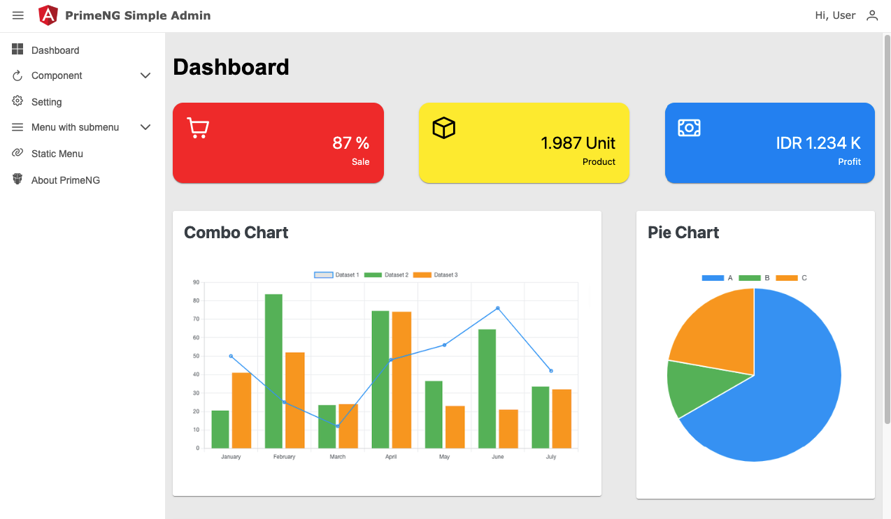
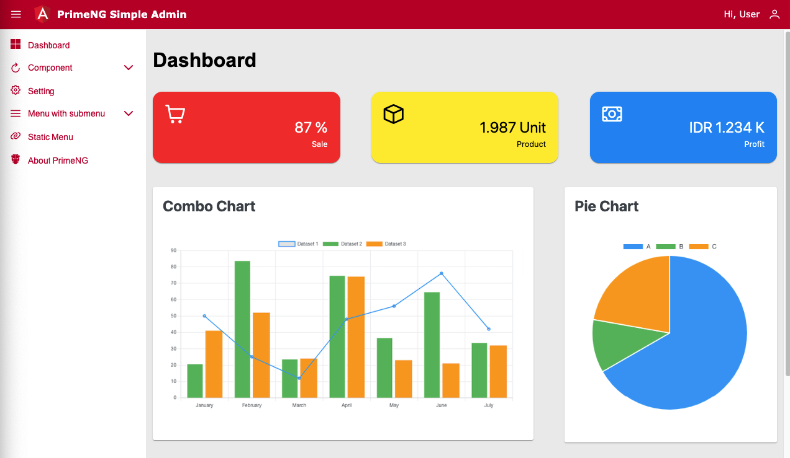
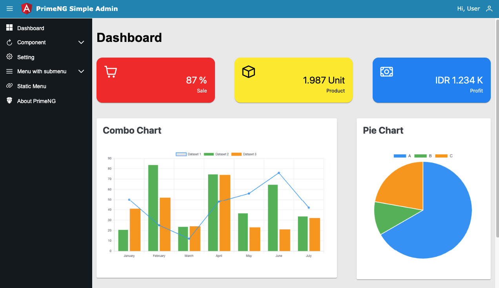

9# PrimeNG Simple Admin
This project was generated with [Angular CLI](https://github.com/angular/angular-cli) version 16.1.0.

## Setup Project
```
git clone https://github.com/fachrosi/primengsimpleadmin.git
cd primengsimpleadmin
npm install
ng serve
```

## Theme : Clean


## Theme : Red Angular


## Theme : Admin LTE


